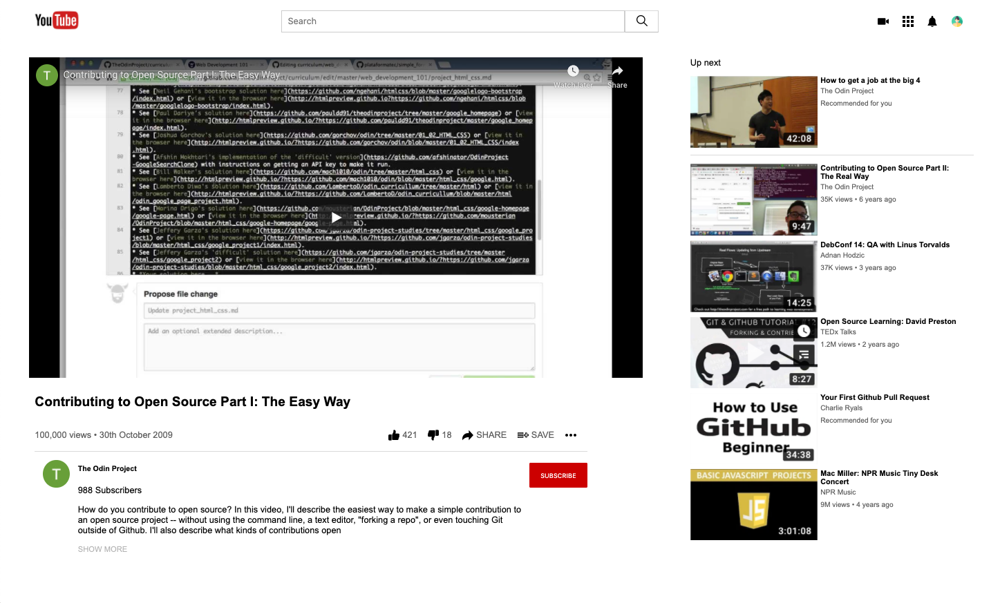

# Project: Embedding Images and Video
​
> This project is a clone of popular video-sharing website, YouTube.
​

​
Looks like YouTube, doesn't work like YouTube.
​
## Built With
​
- HTML
- CSS
​
## Getting Started
​
**To view this project, all you need to do is download the contents of the repository to your computer and open the index.html file using your preferred browser.**
**Modify this file to match your project, remove sections that don't apply. For example: delete the testing section if the currect project doesn't require testing.**
​
​
To get a local copy up and running follow these simple example steps.
​
### Prerequisites
A computer.
A browser of preference.
​
## Authors
​
👤 **Mark Rode**
​
- Github: [@githubhandle](https://github.com/m15e)
​
👤 **Joe Burke**
​
- Github: [@githubhandle](https://github.com/Joseph-Burke)
​
## �� Contributing
​
Feedback is always appreciated! Help us by adding an issue.
​
## Show your support
​
Give a ⭐️ if you like this project!
​
## Acknowledgments
​
- Thanks to YouTube for their inspiring website.
​
## �� License
​
This project is [MIT](lic.url) licensed.